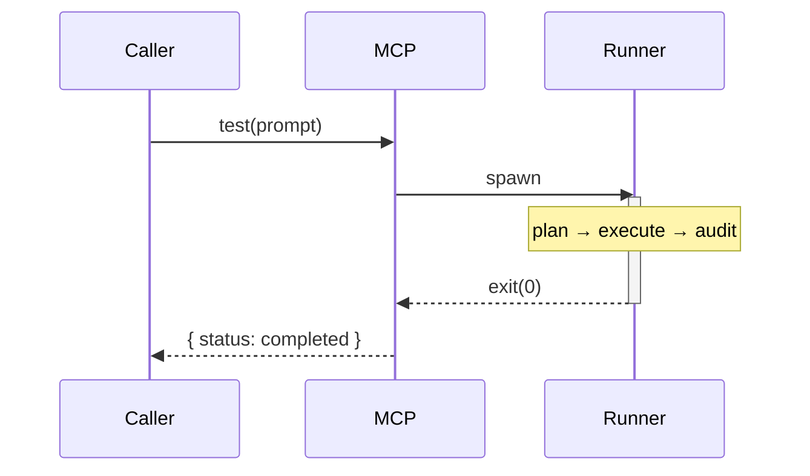
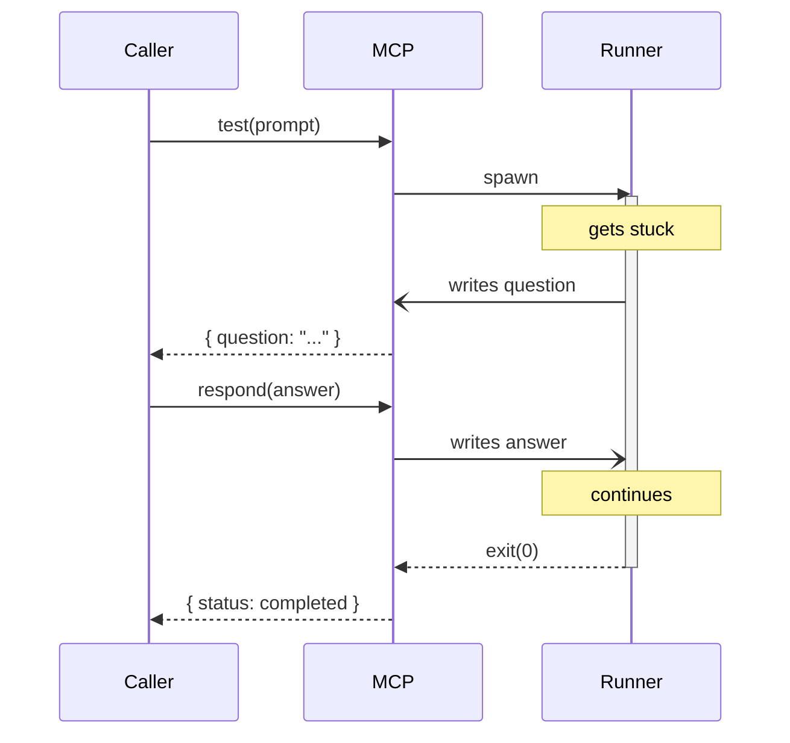

<p align="center">
  <a href="https://github.com/vlddlv/qaclaw">
    
  </a>
</p>

<h3 align="center">Autonomous QA agent exposed over MCP</h3>

<p align="center">
  Give it test instructions in plain English. It opens a headless browser, plans the steps, executes them, and returns pass/fail results.
</p>

<p align="center">
  <a href="https://www.npmjs.com/package/qaclaw"></a>
  <a href="https://github.com/vlddlv/qaclaw/blob/main/LICENSE"></a>
  <a href="https://github.com/vlddlv/qaclaw"></a>
</p>

<p align="center">
  <a href="#quickstart">Quickstart</a> ·
  <a href="#how-it-works">How it works</a> ·
  <a href="#mcp-configuration">MCP setup</a> ·
  <a href="#configuration">Configuration</a> ·
  <a href="#architecture">Architecture</a>
</p>

---

> [!WARNING]
> **Early stage.** Expect rough edges, breaking changes, and incomplete coverage of edge cases.

## Quickstart

```bash
npm install -g qaclaw
```

Or run directly without installing:

```bash
npx qaclaw@latest "Navigate to /users, create a new user, verify it appears in the list"
```

That's it. No config files, no test framework, no selectors. Just describe what to test.

---

## How it works

qaclaw runs your instructions through a staged reasoning process:

```
prompt → Plan → Execute → Recover → Result
                  ↑          |
                  └── Ask ───┘
```

| Stage | What happens |
|-------|-------------|
| **Plan** | A preflight model interprets your instructions into discrete steps |
| **Execute** | The primary model drives the browser, sees the page, and decides what to do |
| **Recover** | If stuck, it escalates to a fallback model to unblock itself |
| **Ask** | Only if both models fail does it ask for help, via stdin (CLI) or MCP |

Answers are persisted so the same question is never asked twice.

---

## MCP configuration

When installed as an MCP server, the calling AI tool (Claude Code, Cursor, etc.) acts as the supervisor. It reads your codebase, understands the product, and answers qaclaw's questions with full context, no human in the loop.

Add to your AI tool's MCP config:

```json
{
  "mcpServers": {
    "qaclaw": {
      "command": "npx",
      "args": ["qaclaw@latest"],
      "env": {
        "GOOGLE_API_KEY": "your-key",
        "QA_TARGET_URL": "http://localhost:3100"
      }
    }
  }
}
```

Works with **Claude Code**, **Cursor**, **Windsurf**, **Continue**, **Open Code**, and any MCP capable tool.

<details>
<summary><strong>Using a local checkout instead</strong></summary>

```json
{
  "mcpServers": {
    "qaclaw": {
      "command": "node",
      "args": ["mcp.js"],
      "cwd": "/path/to/qaclaw"
    }
  }
}
```

</details>

---

## CLI usage

```bash
qaclaw "Go to /settings, change timezone to PST, verify it shows in the header"
```

In CLI mode, clarifications are handled interactively via stdin instead of the MCP bridge.

### API keys

**MCP users**: set your key in the MCP config `env` block shown above.

**CLI users**: export in your shell profile:

```bash
# Pick one provider
export GOOGLE_API_KEY=your-key       # google/* models (default)
export ANTHROPIC_API_KEY=your-key    # anthropic/* models
export OPENAI_API_KEY=your-key       # openai/* models
```

---

## Configuration

All configuration is via environment variables.

| Variable | Default | Description |
|----------|---------|-------------|
| `QA_TARGET_URL` | `http://localhost:3100` | URL of the app to test |
| `QA_MODEL` | `google/gemini-2.5-pro` | Primary model (`provider/model`) |
| `QA_FALLBACK_MODEL` | `google/gemini-2.5-flash` | Fallback model for recovery |
| `QA_PLANNER_MODEL` | same as fallback | Preflight planner model |
| `QA_HEADLESS` | `true` | Set `false` to watch the browser |
| `QA_VIEWPORT_WIDTH` | `1920` | Browser viewport width |
| `QA_VIEWPORT_HEIGHT` | `1080` | Browser viewport height |
| `QA_CHROME_PROFILE` | (see tips) | Path to a Chrome user data dir |

Model format is `provider/model-name`. The agent picks the right API key based on the provider prefix.

---

## Commands and skills

Create shortcuts for AI tools that support project level commands:

<details>
<summary><strong>Claude Code</strong>: <code>.claude/commands/qa.md</code></summary>

```
Run a QA test. Call the `test` MCP tool with $ARGUMENTS as the prompt.
If the response has a `question`, answer it with `respond` or ask the user.
Repeat until status is completed or failed. Report the results.
```

</details>

<details>
<summary><strong>Cursor</strong>: <code>.cursor/rules</code></summary>

```
When asked to run QA tests, use the `test` MCP tool with the user's instructions.
Handle clarifications by calling `respond`. Report pass/fail results.
```

</details>

**Other tools**: the MCP tool descriptions are self documenting. Most tools figure out the protocol from the descriptions alone.

---

## Architecture

### Communication flow

**Happy path**: test runs without questions:



**With clarification**: agent gets stuck and needs input:



### Why this split?

The caller doesn't drive the browser. The agent does.

| Benefit | Detail |
|---------|--------|
| **Fire and forget** | Send instructions, get results. No browser state management. |
| **Model agnostic** | Claude, GPT, Gemini, local models, anything that speaks MCP. |
| **Autonomous recovery** | Handles stuck situations, model escalation, and retries on its own. |

---

## Agent internals

### Model escalation

```
Primary model ──stuck──→ Fallback model ──stuck──→ Ask caller ──answer──→ Primary model
```

### Clarifications

When the agent hits something ambiguous, it asks. Answers are persisted to `.qa-agent/clarifications.json` and scoped by prompt hash. The same question is never asked twice.

| Scope | Behavior |
|-------|----------|
| **Prompt scoped** | Tied to a specific test prompt. Only loaded when that exact prompt runs again. |
| **Global** | Loaded for every test. Useful for shared knowledge like credentials. |

### Recipes

After a successful run, the agent saves the action sequence as a **recipe** in `.qa-agent/recipes.json`. On repeat runs the recipe is injected as suggested steps, the planner is skipped entirely, and matching clarifications are merged in. If the UI has changed and the recipe fails, the agent falls back to exploration automatically.

### Caching

Stagehand's built-in caching (`.qa-agent/stagehand-cache/`) stores LLM responses for identical page states. Combined with recipes and clarifications, repeat runs are dramatically faster and cheaper.

### Audit phase

Include expected outcomes in your prompt and a separate agent pass verifies each one:

```
✅ PASSED: timezone shows PST in the header
❌ FAILED: notification preference still shows "email", expected "slack"
⚠️  UNKNOWN: cannot verify email was sent (requires inbox access)
```

---

## Tips

### Bypassing authentication

Create a dedicated Chrome profile, log in once manually, then point qaclaw at it:

```bash
# 1. Create profile and log in
/Applications/Google\ Chrome.app/Contents/MacOS/Google\ Chrome \
  --user-data-dir="$HOME/Library/Application Support/Google/Chrome-QAClaw" \
  --no-first-run

# 2. Log in to your app, then close the browser

# 3. Set the env var
export QA_CHROME_PROFILE="$HOME/Library/Application Support/Google/Chrome-QAClaw"
```

### Watching the agent

```bash
QA_HEADLESS=false qaclaw "your test instructions"
```

### Writing good prompts

- **Be specific**: `"Go to /users, click 'Add User', fill in name 'Test User', click Save, verify 'Test User' appears in the list"`
- **Include expected outcomes**: append `"Expected outcome: the user appears with status 'Active'"` to trigger the audit phase
- **Describe steps in order**: the planner handles dependencies

### Logs

All output goes to `.qa-agent/runner.log`. MCP responses are truncated to ~8000 chars. Check the log for the full trace.

---

## Night shift

The [night shift agents](https://jamon.dev/night-shift) workflow is an ideal fit. Queue test instructions before you leave for the day, let the agent work through them overnight, and come back to results and a fully populated memory in the morning. Each run gets faster as recipes and clarifications accumulate.

---

## Built with

- [Stagehand](https://github.com/browserbase/stagehand): AI browser automation framework

## License

[MIT](LICENSE)
